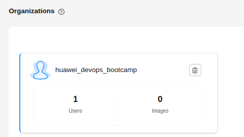
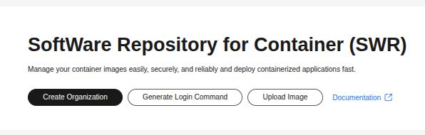
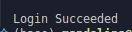
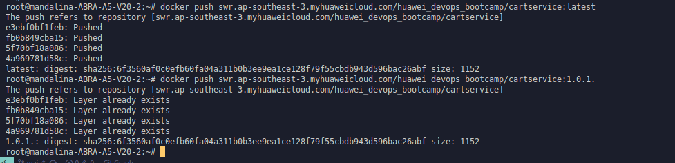
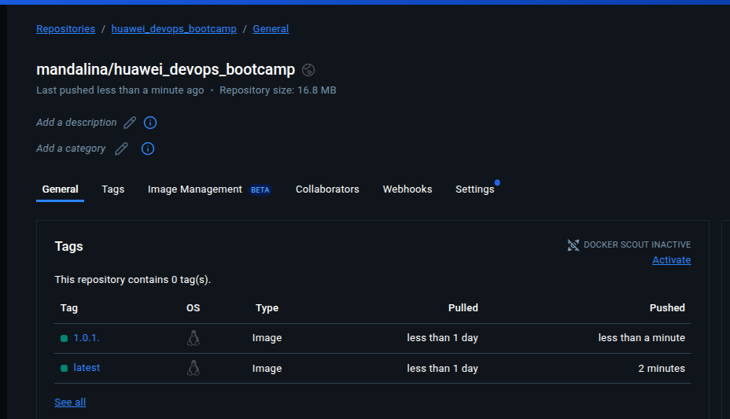

## Contents

1. [Introduction](#introduction)  
2. [Downloading the Project](#1-downloading-the-project)  
3. [Building the `cartservice` Service](#2-building-cartservice-service)  
   - [3.1 Why tag with both `latest` and a version?](#31-why-tag-with-both-latest-and-a-version)  
4. [Uploading Images to Huawei Cloud](#3-uploading-images-to-huawei-cloud)  
5. [Uploading Images to Docker Hub](#4-uploading-images-to-docker-hub)  


## 1. Introduction
Since I have [basic understanding of docker](https://www.udemy.com/certificate/UC-e0dd41d1-fc28-4532-acd3-c195729728d5/), I continued to use cloud systems.
This week our aim was to create [this](https://github.com/yagizkarakus/Huawei_Devops_bootcamp) project inside a container system. And to be precise, this is the commit hash that is used in this example: "e99c2a2". Since I already installed docker on my computer, you can download and install via [this link](https://docs.docker.com/engine/install/)

---

## 2. Downloading the Project

```bash
git clone https://github.com/yagizkarakus/Huawei_Devops_bootcamp.git
cd Huawei_Devops_bootcamp
git checkout e99c2a2
```

This command clones the repository and sets its HEAD to the `e99c2a2` commit.

After downloading the repository then we have to build `cartservice` service 

## 3. Building `cartservice` Service

```bash 
cd /src/cartservice/src
docker build \
  -t cartservice:latest \
  -t cartservice:1.0.1. \
  .
```

This command builds the container and creates 2 image called `cartservice:latest` and `cartservice:1.0.1.`.

### 3.1. Why tag with both latest and a version?


- `latest` always points to the most recent successful build, so your deployment pipelines can simply pull `cartservice:latest` and get the newest stable image.

- `1.0.1.` is an immutable snapshot: if you discover a bug or need to roll back, you can pull exactly `cartservice:1.0.1.` even after newer versions are released.

## 4. Uplaoding Images to Huawei Cloud

Via [this service](https://www.huaweicloud.com/intl/en-us/product/swr.html) we can upload our images [freely](http://activity.huaweicloud.com/intl/en-us/free_packages/index.htmlwer) to cloud!



After creating a new Organization, we can continue using this service. First we have to login our docker to this remote service via this command: 

```bash
docker login -u ******* -p ******* swr.ap-southeast-3.myhuaweicloud.com
```

You can get your command from dashboard of SWR:


After using the command, the output should be like this:  


We have to re-tag these images like this:
```bash
sudo docker tag cartservice:latest swr.ap-southeast-3.myhuaweicloud.com/huawei_devops_bootcamp/cartservice:latest


sudo docker tag cartservice:1.0.1. swr.ap-southeast-3.myhuaweicloud.com/huawei_devops_bootcamp/cartservice:1.0.1.
```

And then upload it like this:
```bash
sudo docker push swr.ap-southeast-3.myhuaweicloud.com/huawei_devops_bootcamp/cartservice:latest

sudo docker push swr.ap-southeast-3.myhuaweicloud.com/huawei_devops_bootcamp/cartservice:1.0.1.
```
While doing this step on my personal computer I had a problem which I solved by using root's privilegs.


Here we can see that our images are successfully uploaded to the huawei clouds' SWR service. 

## 5. Uploading Images to Docker Hub

```bash

sudo docker tag cartservice:latest mandalina/huawei_devops_bootcamp:latest

sudo docker tag cartservice:latest mandalina/huawei_devops_bootcamp:1.0.1.
```

```bash
docker push mandalina/huawei_devops_bootcamp:latest

docker push mandalina/huawei_devops_bootcamp:1.0.1.
```

After these commands, we can see at docker hub that our images are pushed successfuly:

