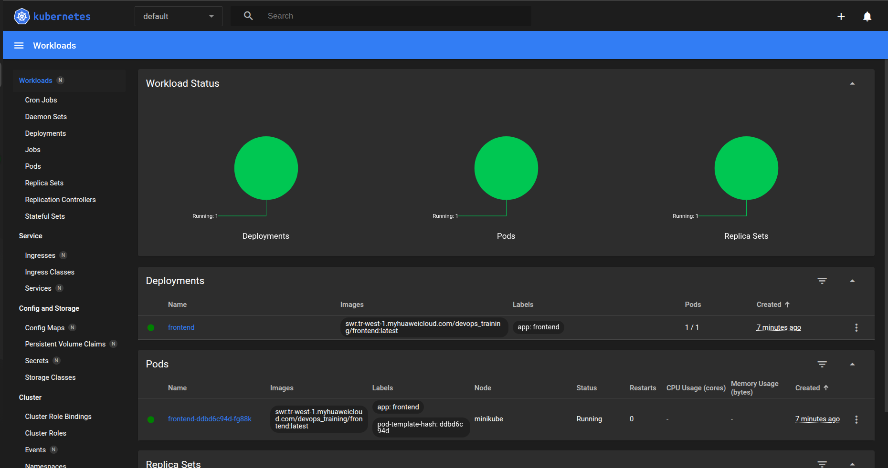
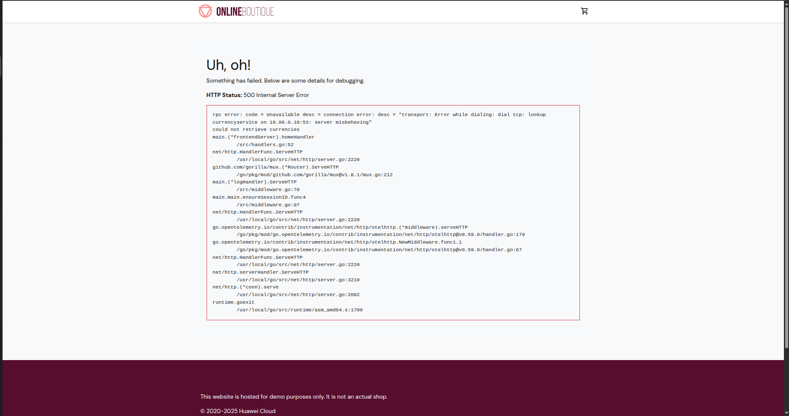
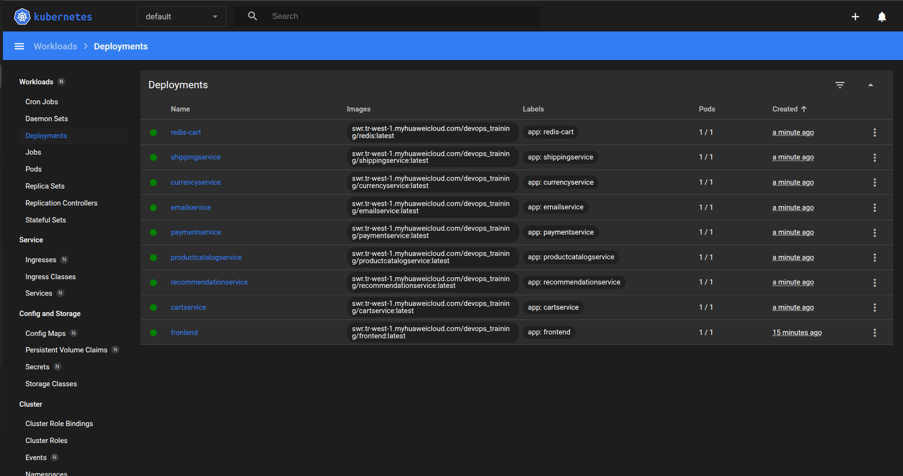
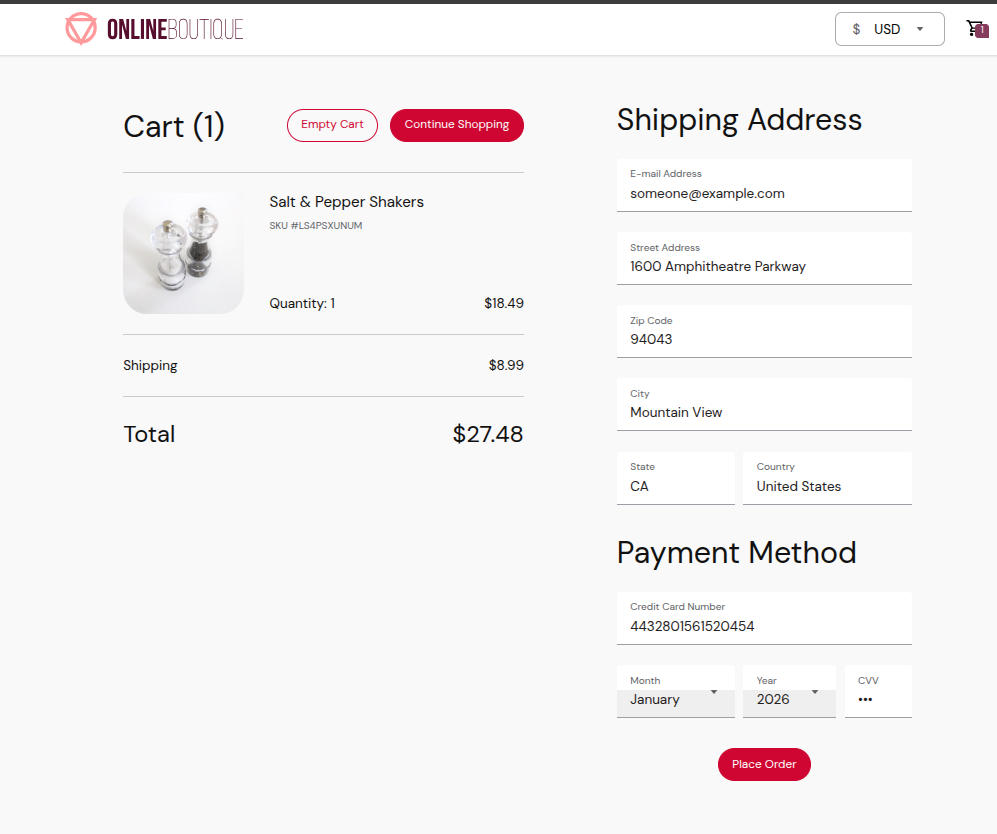
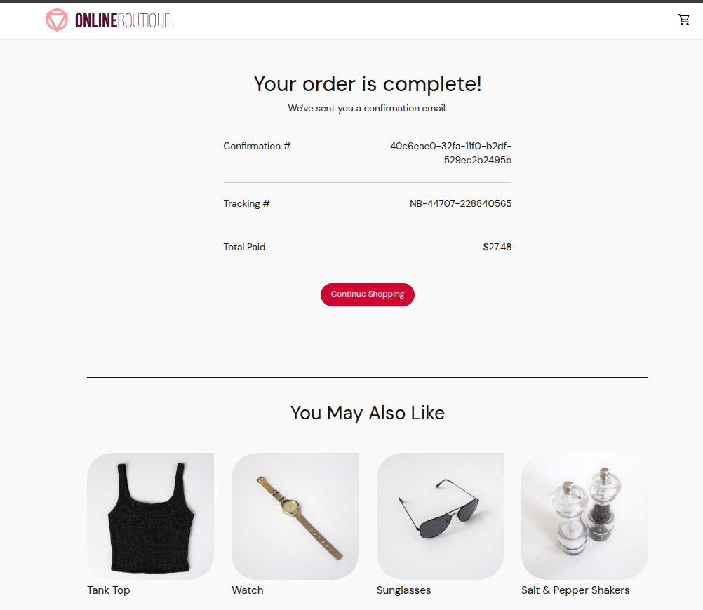
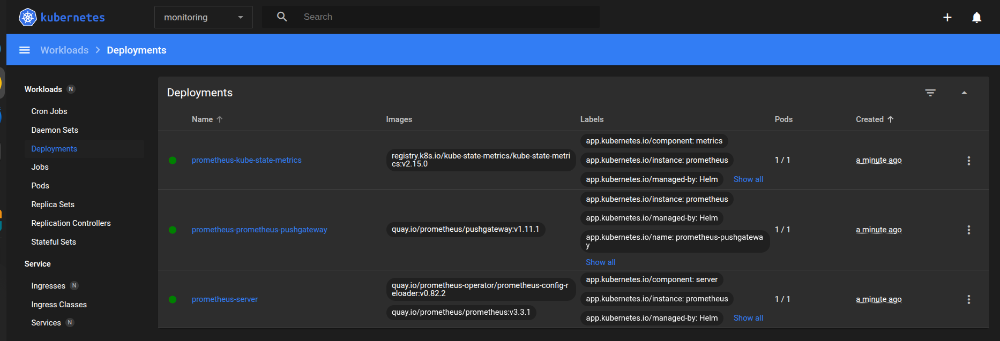
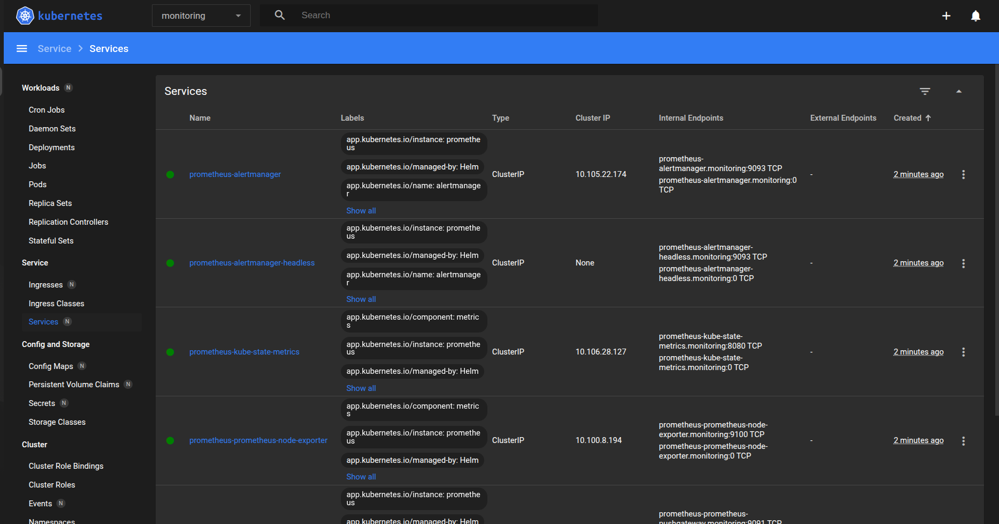
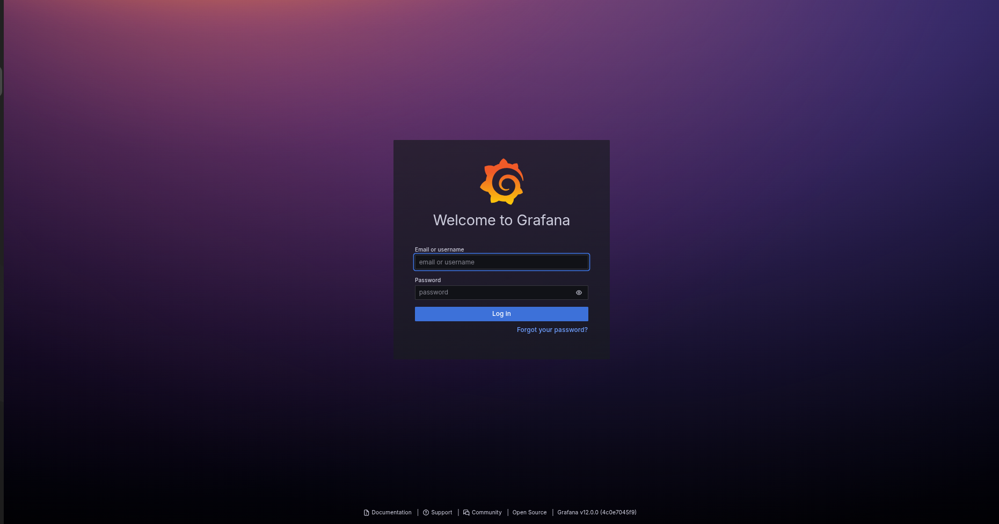
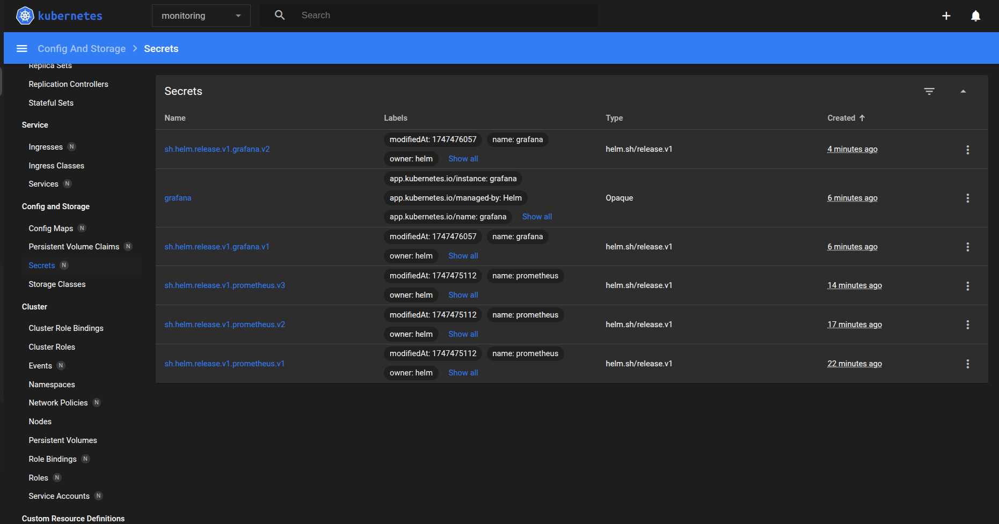
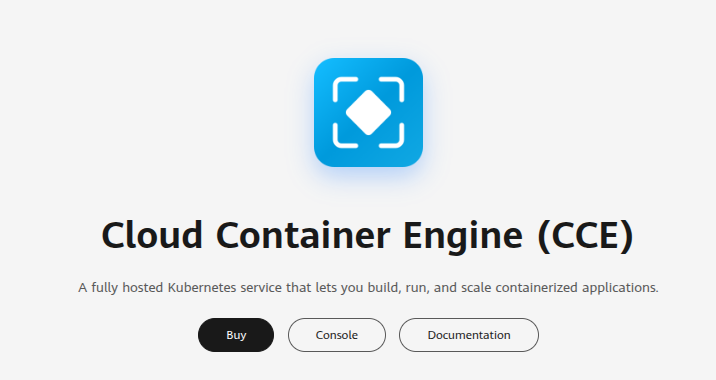

## Contents

1. [Introduction](#1-introduction)  
2. [Installing Kubectl, Minikube and Helm](#2-installing-kubectl-minikube-and-helm)  
3. [Starting Our Minikube Service](#3-starting-our-minikube-service)  
4. [Starting Our Micro Services](#4-starting-our-micro-services)  
5. [Creating a Namespace](#5-creating-a-namespace)  
6. [Persistent Volumes On Kubernetes](#6-persistent-volumes-on-kubernetes)  
7. [What is Helm?](#7-what-is-helm)  
   - [5.1 Installing Prometheus](#71-installing-prometheus)  
   - [5.2 Running our Services via Helm](#72-running-our-services-via-helm)  
   - [5.3 Installing Grafana](#73-installing-grafana)  
8. [Cloud Container Engine](#8-cloud-container-engine)  

## 1. Introduction

In second week of our bootcamp is focused on using Kubernetes.

## 2. Installing Kubectl, Minikube and Helm

If your operating system is windows, you can install needed packages and tools from [this link](https://github.com/yagizkarakus/Huawei_Devops_bootcamp/blob/main/Installations.md)

Since I use linux, i installed it from original sites:

- [Kubectl](https://kubernetes.io/docs/tasks/tools/install-kubectl-linux/)
- [Minikube](https://minikube.sigs.k8s.io/docs/start/?arch=%2Flinux%2Fx86-64%2Fstable%2Fbinary+download)
- [Heml](https://helm.sh/docs/intro/install/)

--- 

## 3. Starting Our Minikube Service

After installing Minikube tool, we have to run our minikube with this command:

```bash
minikube start  
```
We can also use its dashboard for better understanding of our services:

```bash
minikube dashboard --url 
```

Now in order to use load balancing inside out minikube, we can use this command:

```bash
minikube tunnel
```

This lets us to use single ip for more than 1 pods.

## 4. Starting Our Micro Services 

Since out Minikube is running, now we can proceed to run our other imagaes.

```bash 
kubectl apply -f frontend.yaml
```

This creates a working node with frontend container and with next command, we can get this service's ip:

```bash
minikube service frontend-external --url
```

After running this code, we can see our pods' information in the dashboard:


After creating our tunnel from section #1, we can see our frontend service from the ip address given to us:


--- 

After being sure that our system works, now we can move on to the next services and run them: 
```bash
# kubectl apply -f frontend.yaml

kubectl apply -f cartservice.yaml
kubectl apply -f checkoutservice.yaml
kubectl apply -f currencyservice.yaml
kubectl apply -f emailservice.yaml
kubectl apply -f paymentservice.yaml
kubectl apply -f productcatalogservice.yaml
kubectl apply -f recommendationservice.yaml
kubectl apply -f rediscartservice.yaml
kubectl apply -f shippingservice.yaml
```


We clearly see that all of our services are up and running!

We can also test the sites usability:


--- 

## 5. Creating a Namespace

By default, Kubernetes places all resources into the `default` namespace, but using namespaces lets you partition your cluster into multiple virtual sub-clusters (e.g. `dev`, `staging`, `prod`). This gives you:

- Environment separation – isolate development, testing, and production workloads so they don’t conflict.

- Access control – assign RBAC rules per namespace to restrict who can view or modify resources.

- Resource management – apply `ResourceQuota` and `LimitRange` objects to cap CPU, memory or object counts per namespace.

- Cleanup simplicity – delete an entire namespace to remove all its resources in one command.

Overall, namespaces help you run multiple independent environments in a single Kubernetes cluster, giving you both organizational clarity and stronger control over access and resource usage.

This command creates a new namespace called `helmns`:

```bash 
kubectl create ns helmns
```
And we can use this namespace like this:

```bash
kubectl apply -f frontend.yaml -n helmns
```

## 6. Persistent Volumes On Kubernetes

First we created a new namespace for database usage:

```bash
kubectl create ns database
```

And we change our directory to the mongodb inside the github repo:

```bash
cd Huawei_Devops_bootcamp/MongoDB
```

And then creating our deployment like this:

```bash
kubectl apply -f database.yaml -n database
```

After deployment, now we can get this pods' name in order to get inside of this container:

```bash 
kubectl get pods -n database
```

```
NAME                       READY   STATUS    RESTARTS   AGE
mongodb-67d4b669f5-2xtzr   1/1     Running   0          35s
```

This is my output, after this stage I have continue like this:

```bash 
kubectl exec -n database -it mongodb-67d4b669f5-2xtzr -- bash 
```

After this commnad, we are inside the container but we have to login in: 

```bash
mongosh -u admin -p adminpass
```

Now we can create database and continue:

```bash 
use testdb
db.mycollection.insertOne({message: "Hello, Minikube!"})
```

```
OUTPUT
testdb> db.mycollection.insertOne({message: "Hello, Minikube!"})
... 
{
  acknowledged: true,
  insertedId: ObjectId('68285377812b5e21ead861e0')
}
```

Lets check this collection:

```bash 
db.mycollection.find()
```

Lets delete our pod and run it again to check if our data is persistent!

```bash
kubectl delete pod mongodb-67d4b669f5-2xtzr -n database
```

Right after this command runs, we can see that another pod created instantly. Lets get inside to it and then check if our data is persistent!

```bash

kubectl exec -n database -it mongodb-67d4b669f5-xkt95 -- bash 
use testdb
mongosh -u admin -p adminpass
```

And Voila! Our data is indeed persistent.

```bash 
Current Mongosh Log ID: 6828547db7eba4f213d861df
Connecting to:          mongodb://<credentials>@127.0.0.1:27017/?directConnection=true&serverSelectionTimeoutMS=2000&appName=mongosh+2.5.0

testdb> db.mycollection.find()
[
  {
    _id: ObjectId('68285377812b5e21ead861e0'),
    message: 'Hello, Minikube!'
  }
]
testdb> 
```

## 7. What is Helm?

Helm is the package manager for Kubernetes. By using reusable “charts” with parameterized templates, it lets you define, install, and upgrade complex applications in your cluster with minimal effort.

## 7.1. Installing Prometheus

First we need to create another namespace for best practice:

```bash 
kubectl create ns monitoring
```

After this, we can now proceed to the [this link](https://artifacthub.io/packages/helm/prometheus-community/prometheus) and install needed packages from given commands: 

```bash
helm repo add prometheus-community https://prometheus-community.github.io/helm-charts
helm repo update
helm install prometheus prometheus-community/prometheus -n monitoring
```

At this point in our minikube dashboard we can select namespace `monitoring` and we can see that prometheus is installed and running:



If we look at our services tab in `monitoring` namespace, we can see that our services are using ClusterIp:



To change this type, we can use this command:

```bash 
helm upgrade prometheus prometheus-community/prometheus --set server.service.type=NodePort -n monitoring
```

And then if we run this command, we can access this service:

```bash 
minikube service prometheus-server --url -n monitoring
```

## 7.2. Running our Services via Helm

This commands uses charts.yaml to create services configured before:

```bash
helm install mineboutique . -n helmns
```

## 7.3. Installing Grafana

To install grafana, we can use [this link](https://artifacthub.io/packages/helm/grafana/grafana):

```bash
helm repo add grafana https://grafana.github.io/helm-charts
helm repo update
```

and then

```bash
helm install grafana grafana/grafana -n monitoring
```

After this we also have to update our grafana service to access: 

```bash 
helm upgrade grafana grafana/grafana --set service.type=NodePort -n monitoring
```

Then this command runs on a given ip:

```bash 
minikube service grafana --url -n monitoring
```

After opening the given ip, we can see that it wants us to login:



In we go to our minikube dashboard, `monitoring` namespace and then `secrets`, we can see grafana's secret:



After logging in, we can create a connection to prometheus from grafana. We can give it the ip we got from minikube `http://192.168.49.2:31733/`

## 8. Cloud Container Engine

I wasn't able to continue this section from the course because CCE service is not included inside the [free trials](https://activity.huaweicloud.com/intl/en-us/free_packages/index.html) but I understand usage of this service from the lesson.
