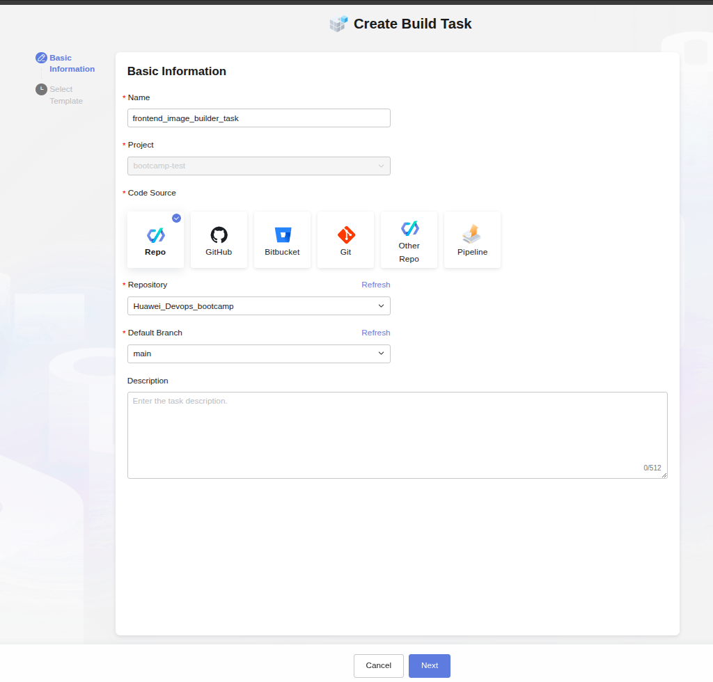
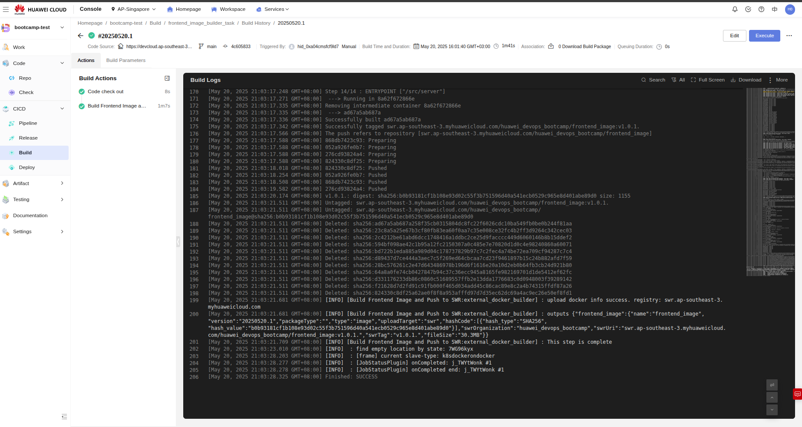

## Contents

- [1. Introduction](#1-introduction)
- [2. Installing Jenkins](#2-installing-jenkins)
  - [2.1. Installing Plugins](#21-installing-plugins)
  - [2.2. Kubernetes Configurations Inside Jenkins](#22-kubernetes-configurations-inside-jenkins)
  - [2.3. Deep Dive into Pipelines](#23-deep-dive-into-pipelines)
- [3. Using CodeArts](#3-using-codearts)
  - [3.1. Creating a Custom Check Test](#31-creating-a-custom-check-test)
  - [3.2. Creating Tasks in CI/CD Build Section](#32-creating-tasks-in-cicd-build-section)
  - [3.3. Creating Deploy Tasks](#33-creating-deploy-tasks)
  - [3.4. Creating Pipelines in CodeArts](#34-creating-pipelines-in-codearts)


## 1. Introduction

In third week of our bootcamp we are focused on using CodeArts and Jenkins.

## 2. Installing Jenkins

I installed it before but if you want to install Jenkins to your pc, you can look [this link](https://www.jenkins.io/doc/book/installing/)

## 2.1. Installing Plugins

In our jenkins dashboard, we can install some needen plugins via `Dashboard > Manage Jenkins > Plugins`.

What will we need?
- Kubernetes CLI Plugin
- Kubernetes (Cloud Provider)

## 2.2. Kubernetes Configurations Inside Jenkins

In order to communicate and give access to jenkins, we have to make some configurations on our kubernetes:

- Create namespace
- Create ServiceAccount
- Generate token
- Bind admin role

```bash
kubectl create ns jenkins # Create namespace
kubectl create sa jenkinssa -n jenkins # Create ServiceAccount
kubectl create token jenkinssa -n jenkins --duration=10h # Generate token
kubectl create rolebinding jenkins-admin-binding --namespace=jenkins --serviceaccount=jenkins:jenkinssa --clusterrole=admin # Bind admin role
```

After doing this steps, now we can configure jenkins from its dashboard. Lets go to the `Manage Jenkins > Clouds > New Cloud`


We can now create cloud connection to our kubernetes. After configuring needed sections like `namespace`, `kubernetes url` and `Credentials` we can save it. We can get kubernetes url with this:

```bash
kubectl config view
```

After configuring `namespace`, `kubernetes url` and `Credentials`, we can create a new pipeline for our purpose:


In the `Pipeline` section, we can write this code to test our system:

```yml
pipeline {
  agent {
    kubernetes {
      yaml """
apiVersion: v1
kind: Pod
spec:
  containers:
    - name: ubuntu
      image: ubuntu:latest
      command:
        - cat
      tty: true
"""
    }
  }
  stages {
    stage("Run ubuntu") {
      steps {
        container("ubuntu") {
          sh 'ls'
        }
      }
    }
  }
}

```

And if we look at the output of the pipeline, we can see that its running: (it gave me some errors before because of the syntax misusage. After that it was running but couldnt get images because my connection is really slow :')


## 2.3. Deep Dive into Pipelines

Pipelines is one of the useful tools we get our hands on! It makes automation easier!

Here we can create another pipeline with [this script.](https://github.com/yagizkarakus/Huawei_Devops_bootcamp/blob/main/jenkinsfile) By the way if you have linux distribution you have to change `bat`s to `sh` in order scripts to work! 

With this script, we can get the latest version of our project, build it and then deploy it just like this:


## 3. Using CodeArts

For our purposes, lets go and use CodeArts free:


Lets create our project:


After creating our project, lets go into Repo section and give our git url:


We have to give our github project's link like this:


If we look at our repo, we can see that our github project has been cloned here:


## 3.1. Creating a Custom Check Test

In CodeArts we have something called Check service. In this service, we can configure specific tests.


In here we can see that our newly created check test is works on these programming languages(since we are using service free, its not checking for every programming languages.)


In quality gate, we can specify some tresholds to check if our code has problems more or less than our threshold. 


## 3.2. Creating Tasks in CI/CD Build Section 

In Build section, we can create tasks and run them. Lets create a new task like this:



After configuring in the image:


If we run our task, this will be the output:



And if we check SWR service if our image is uploaded there, we can also see our newly created image with the tag `v1.0.1.`:


## 3.3. Creating Deploy Tasks

We can also create deploy applications in CodeArts which is easy for general use. Lots of options is available for us to use.


We can also create a deployment application that uses Huawei's CCE service. This way it can deploy directly on Huawei's servers. 


I will not go any further for deploying because I am afraid that CCE service is not free.

## 3.4. Creating Pipelines in CodeArts

If proccesses are created constantly, we have to create a pipeline that does these steps automatically.


We can create a build step like this:


We can also add deploy step to this pipeline:


We can also create `Pass Conditions` which is needed when building and testing the lately created build:


We can also use `Execution Plan` to trigger our pipeline:


