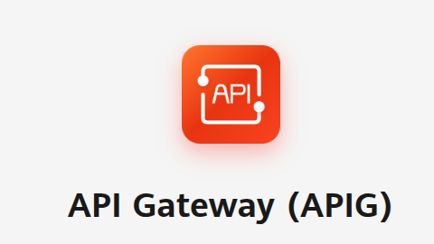
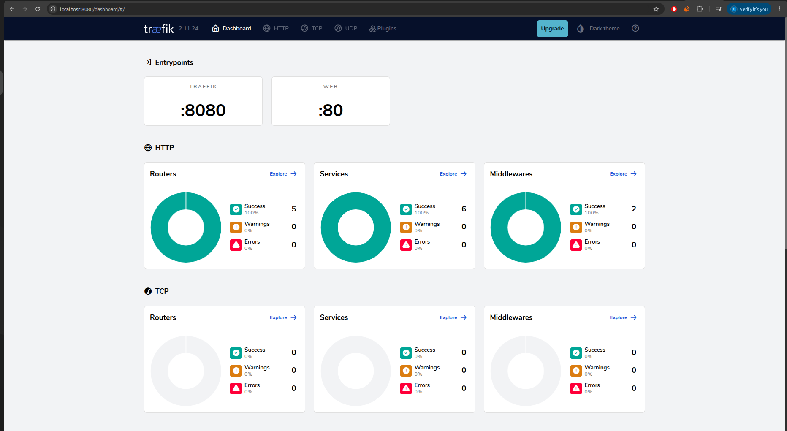
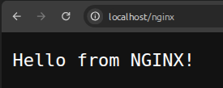
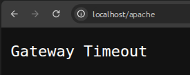

## Contents

- [1. Introduction](#1-introduction)
- [2. API Gateway](#2-api-gateway)
  - [2.1. Why Use API Gateway](#21-why-use-api-gateway)
  - [2.2. API Gateway Basic Features](#22-api-gateway-basic-features)
  - [2.3. Open Source Gateways vs Huawei Cloud APIG](#23-open-source-gateways-vs-huawei-cloud-apig)
- [3. Huawei Cloud's APIG Features](#3-huawei-clouds-apig-features)
- [4. Using Traefik](#4-using-traefik)
  - [4.1. Adding More Service to Our Traefik](#41-adding-more-service-to-our-traefik)
- [5. Huawei Cloud's APIG and CCE Services](#5-huawei-clouds-apig-and-cce-services)
  - [5.1. Buying an APIG Service](#51-buying-an-apig-service)

## 1. Introduction

In forth week of our bootcamp we are focused on using Huawei's APIG Service.

## 2. API Gateway

An API gateway is a network component that acts like a reverse proxy between clients and microservices.

<p align="center">
  
</p>

## 2.1. Why Use API Gateway

 - Security
 - Load Balancing
 - Routing
 - Protocol Transformations
 - Client Simplification

## 2.2. API Gateway Basic Features

 - SSL Termination
 - Versioning 
 - Logging & Monitoring
 - Caching 
 - Routing 
 - Authentication
 - Rate Limiting
 - Load Balancing


## 2.3. Open Source Gateways vs Huawei Cloud APIG 

| Feature           | Open-Source          | Huawei APIG (Cloud)                         |
|-------------------|----------------------|----------------------------------------------|
| Installation      | Manual setup         | Fully managed service                       |
| Scalability       | Manual               | Automatic                                   |
| Security          | Self-integrated      | Built-in IAM & WAF                          |
| Monitoring        | External tools       | Built-in observability dashboard            |
| Integration       | DIY                  | Ready integration with Huawei cloud services|


--- 

In terms of needing scalability, security and all other features, Huawei Cloud's APIG service comes in for help. 

## 3. Huawei CLoud's APIG Features

- API Lifecycle 
- Cloud Native Gateway
- Built-in Debugging Tool
- Version Management

## 4. Using Traefik 

Lets first get needed scripts from [this link.](https://github.com/yagizkarakus/Huawei_Devops_bootcamp/tree/main/traefik)

After getting needed files, lets deep dive into coding and creating!

```bash 
cd Huawei_Devops_bootcamp/traefik/
docker compose up -d
```

This command creates configured containers for our use case. After containers are up and running, we can go to `localhost:8080` to check traefik dashboard



And to check our traefik is working or not, we can go to the `localhost/nginx` and this should be the output:

<p align="center">
  
</p>

## 4.1. Adding More Service to Our Traefik

Lets run this command:

```bash
docker run -d \
  --name apache \
  -l "traefik.enable=true" \
  -l 'traefik.http.routers.apache.rule=PathPrefix(`/apache`)' \
  -l "traefik.http.routers.apache.entrypoints=web" \
  -l "traefik.http.services.apache.loadbalancer.server.port=80" \
  httpd:alpine
```

After running this container and trying to connect to `localhost/apache`, we get an error saying:

<p align="center">
  
</p>

Why this happens? It is because they are not on the same network!

Lets stop this container and remove it, and then run it the correct way: 

```bash
docker stop apache
docker rm apache

## running it the right way
docker run -d   \
--name apache   \
--network traefik_default   \
-l 'traefik.enable=true'   \
-l 'traefik.http.routers.apache.rule=PathPrefix(`/apache`)'   \
-l 'traefik.http.routers.apache.middlewares=apache-stripprefix'   \
-l 'traefik.http.middlewares.apache-stripprefix.stripprefix.prefixes=/apache'   \
-l 'traefik.http.routers.apache.entrypoints=web'   \
-l 'traefik.http.services.apache.loadbalancer.server.port=80'   \
httpd:alpine
```

And Voila! It works:

<p align="center">
  
</p>

--- 

## 5. Huawei Cloud's APIG and CCE Services

In the second week of our training, we had a chance to use CCE service and created our microservices there, this week we also going to improve this project with APIG service.

## 5.1. Buying a APIG Service

To configure out API Gateway, we have to buy one. After creating a Gateway, we can continue to the APIs section and create our APIs.

After creating our APIs, we can successfully connect to our project via ths APIs and we can also monitor 

